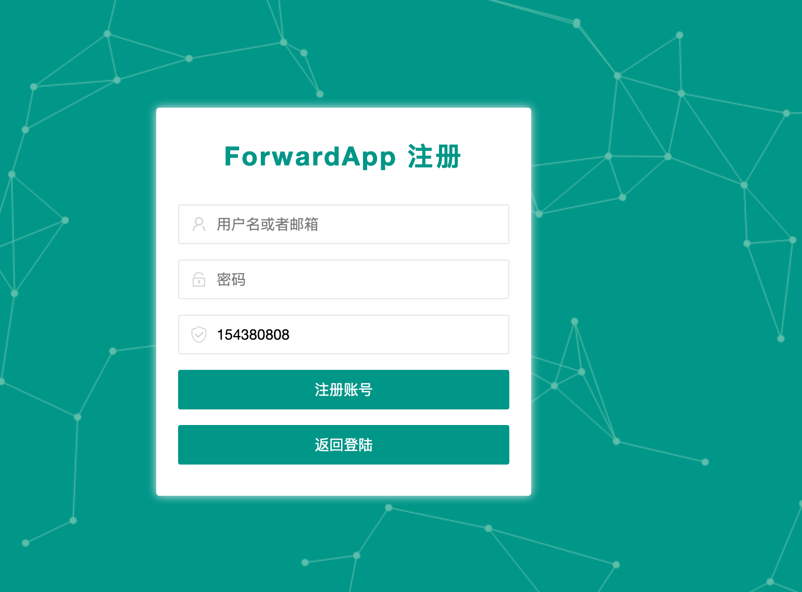
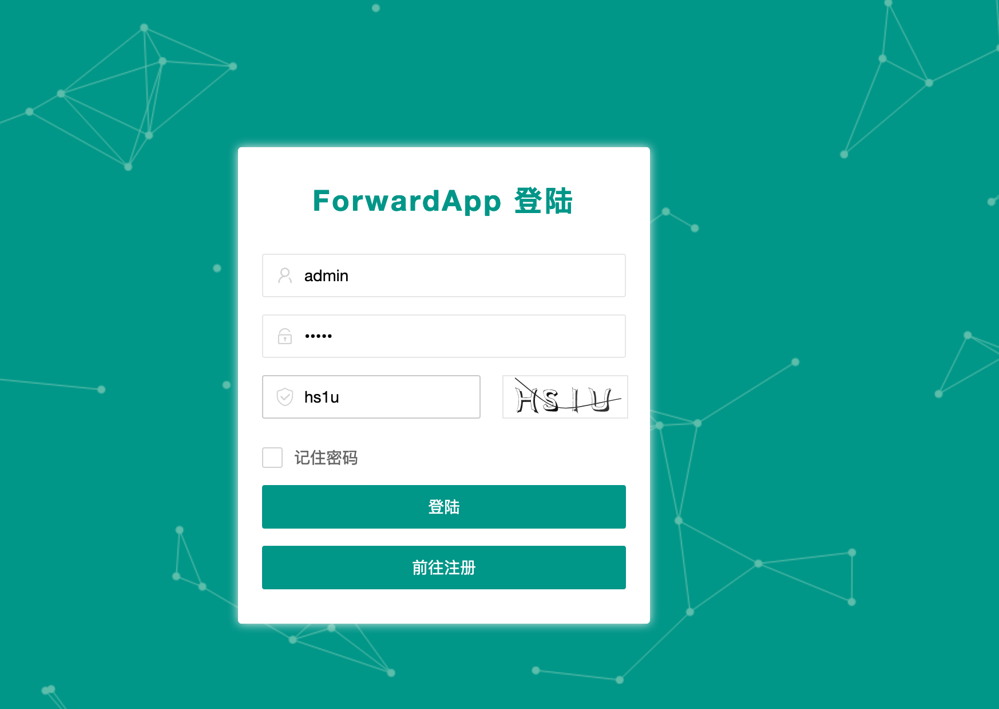
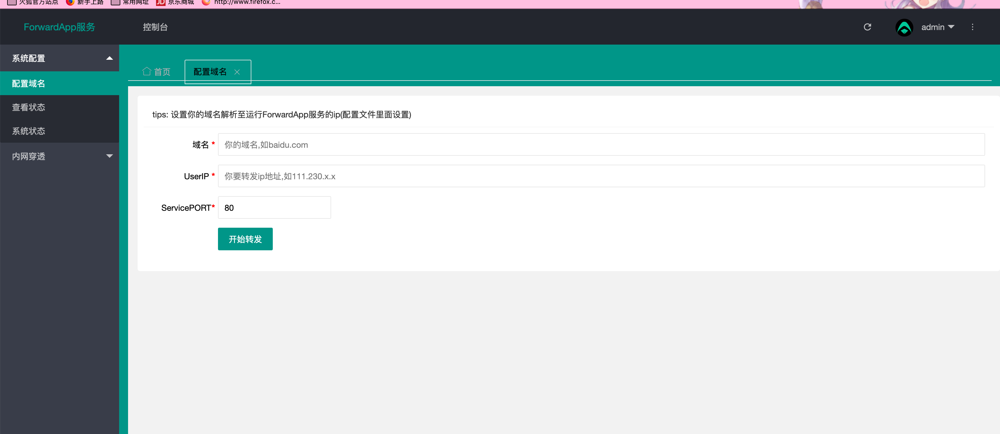
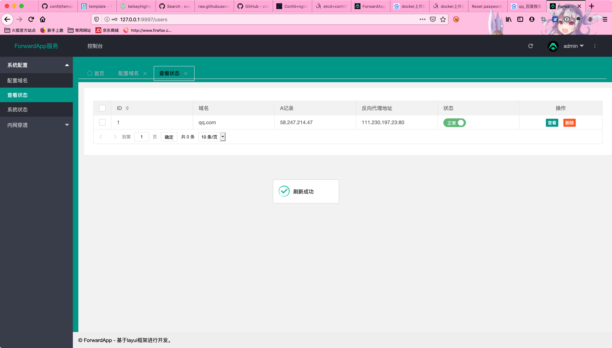

# ForwardApp

## 0x0 介绍

&emsp;&emsp;Confd+Etcd+Nginx反向代理,WEB可视化配置,集成内网穿透模块,docker一键化部署。

在线测试网址: http://47.96.84.148:9997/

## 0x1 效果图展示






## 0x2 安装过程

docker推送镜像过程:

1.`docker login`

2.`xq17/forwardapp:v1`


**正式安装**

1.`git clone https://github.com/mstxq17/ForwardAPP.git`

访问较慢可以尝试下面链接

ps:`git clone https://gitee.com/xq17Boy/ForwardAPP.git`

2.`cd ForwardAPP`

这里建议修改`docker-compose.yml`中的nginx的映射端口为`- 80:80`

3.`docker build -t xq17/forwardapp:v1 .` 先本地建立起这个镜像再继续执行

下载镜像慢,`ubuntu`下直接执行下列命令即可。

```shell
sudo mkdir -p /etc/docker
sudo tee /etc/docker/daemon.json <<-'EOF'
{
  "registry-mirrors": ["https://yvbdiqtf.mirror.aliyuncs.com"]
}
EOF
sudo systemctl daemon-reload
sudo systemctl restart docker
```

4.`docker-compose up -d --build`


端口配置由`docker-compose.yml`定义

>  ```yml
>nginx:
>    ports:
>      - 8081:80
>redis-server:
>    ports:
>      - 6479:6379
>app:
>   ports:
>     - 9997:3002
>  ```


## 0x3 使用指南

搭建完成之后,直接访问:`http://ip:9997/`

添加转发域名的时候: 

首先你要将你的主机域名商的dns解析到运行当前`forwardapp`的不要求备案的服务器ip

然后再`UserIp`中填入你需要域名指向的地址,比如你的腾讯云主机,这样就可以实现绕过备案检测




